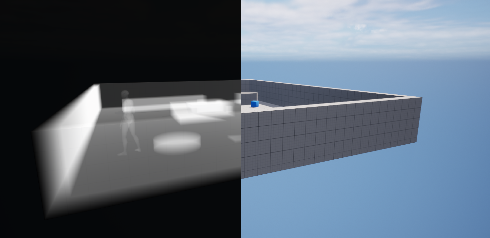

# XRayRender
This Plug-In uses ray tracing to create render resources for X-Ray energy absorption images of all the watertight meshes in the entire game world.

The absorption texture can be sampled from post process materials to create interesting visual effects.

 